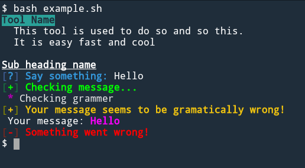

# painter
a tool to make your tools look great!

painter is currently available in python,and bash as are mostly used.

##usage
To test it's python one.Try:
```
python example.py
```
and that of the bash:
```
bash example.sh
```
## Screenshot

